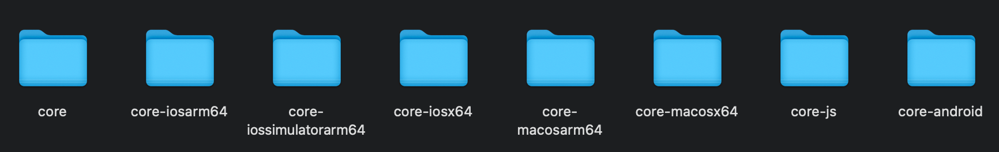

# 编译指引与常见问题
## KMP基础知识

### KMP简介
Kotlin Multiplatform (KMP) 是 JetBrains 推出的一项技术，允许跨多个平台共享代码，同时保留了原生编程的优势。 
支持的平台包括 iOS、Android、桌面、Web 等。


&nbsp;

**核心理念：**
- **共享业务逻辑**：将通用的业务代码编写在 `commonMain` 中，所有平台共享
- **保留原生能力**：每个平台可以有自己的特定实现，调用原生 API
- **编译为原生产物**：代码编译为各平台的原生二进制文件，而非中间层解释执行

### 官方文档
- [Kotlin Multiplatform 入门指南](https://kotlinlang.org/docs/multiplatform/get-started.html)


### 工程配置
Kuikly也是KMP的制品，因此开发环境与KMP要求的环境一致，因此需要先添加Kotlin Multiplatform (KMP)的依赖。

#### 插件配置
```gradle.kts
plugins {
    kotlin("multiplatform")
}


kotlin {
    // 目标平台声明
    androidTarget()
    
    iosX64()
    iosArm64()
    iosSimulatorArm64()
    
    js(IR) {
        browser()
    }
    
    // ohos，仅ohos版本kotlin支持
    ohosArm64 {
    
    }
    
    // 源代码集依赖配置
    sourceSets {
        val commonMain by getting {
            dependencies {
                // 通用依赖
            }
        }
        val androidMain by getting {
            dependencies {
                // Android 特定依赖
            }
        }
        val iosMain by getting {
            dependencies {
                // iOS 特定依赖
            }
        }
        val jsMain by getting {
            dependencies {
                // js 特定依赖
            }
        }
        
        // ohos，仅ohos版本kotlin支持
        val ohosArm64Main by getting {
            dependencies {
                // ohos 特定依赖
            }
        }
        
        ...
    }
}
```

## 编译指引
产物有两种形式：第一种是各平台的最终产物(Android上是.aar，iOS上是.framework，鸿蒙上是 .so)，第二种是KLib(Kotlin 跨平台的库格式)

- 平台产物：每个项目只能有一个，因为只能存在一个Kuikly入口类。
- Kotlin library(KLib)：每个项目可以依赖多个，如果被使用，会被统一编译在最终产物内。

### 平台产物

>注：shared是打包最终产物的模块名

**安卓：**
```bash
./gradlew :shared:assembleRelease
```

> 一个模块对应一个aar

**iOS:**

需要引入 cocoapods 插件
```gradle.kts
plugins {
    kotlin("native.cocoapods")
} 
```
```bash
./gradlew :shared:podPublishReleaseXCFramework
```

> 所有模块统一编译成一个framework

**鸿蒙:**

需要使用定制化特定的Kotlin版本，参考【KMP模块鸿蒙Kotlin/Native适配】 章节
```bash
./gradlew :shared:linkOhosArm64
```
若对ohos另外做了gradle适配，需要使用ohos配置的gradle，如：
```bash
./gradlew -c settings.ohos.gradle.kts :shared:linkOhosArm64
```
> 所有模块统一编译成一个so

### KLib
KLib是Kotlin 跨平台的库格式，包含内容：1(commonMain) + N(targetMain)，其中N取决于你所声明的目标平台

如：Kuikly的core制品就是一个KLib



通常KLib都是发布到maven上

1. 配置 maven-publihs 插件
```gradle.kts
// 参考配置
plugins {

    id("maven-publish")

}

publishing {
    repositories {
        maven {
            credentials {
                username = System.getenv("mavenUserName") ?: ""
                password = System.getenv("mavenPassword") ?: ""
            }
            rootProject.properties["mavenUr?"]?.toString()?.let { url = uri(it) }
        }
    }
}
```
2. 发布
```bash
./gradlew xxx:publish
```
>注：xxx为模块名


## 常见问题
### Sync阶段
- 项目配置有误

**场景1: 堆栈信息指向gradle配置的某一行**

解决方案：

通常为语法错误，按照堆栈提示找到对应行修改即可。

&nbsp;

**场景2: 堆栈信息并无明确指向**

如报错：`java.lang.NullPointer` / `Unable to find method` 等

解决方案：

通常是Gradle、AGP、Kotlin、JDK版本不匹配这类问题，可以检查环境与工程配置

> 注意： 部分 Gradle 插件对 Gradle、AGP 版本有最低要求，或会将项目依赖的 Kotlin 版本自动升级到更高版本。若在新增某个插件后 Sync 失败，可优先排查版本兼容性问题。

- 制品没正确拉取

**场景1: 制品拉取失败**

堆栈信息：
```text
Could not find com.tencent.kuikly:xxx:xxx.
     Required by:
         project :xxx
```
解决方案：

检查是否存在对应版本的制品，以及是否正确配置了制品源。

若使用的是 Kuikly 制品，请确认是否已添加 Kuikly 对应的 Maven 源。

>注：如果拿不准工程配置，可以全局搜 repositories 在所有地方都加上Kuikly的制品源

&nbsp;

**场景2: 所依赖制品没有对应架构**

KMP 工程会根据目标平台声明，自动拉取各制品对应平台的依赖。如果模块配置了各个架构，但是KMP库如果没有对应的架构会导致Sync失败

常见于新引入了一个不支持动态化(无js架构)/不支持鸿蒙的制品，例如：
```text
:shared:ohosArm64Main: Could not resolve org.jetbrains.kotlinx:kotlinx-coroutines-core:1.8.1.
Required by:
    project :shared
```
上述错误说明`:kotlinx-coroutines-core:1.8.1`不包含ohos平台的制品，导致了Sync失败。

解决方案：
1. 使用包含所需目标平台的制品版本，或针对不同目标平台配置不同的依赖；
2. 对工程进行模块化拆分，例如：对于不需要动态化能力的模块，可以不配置 JS 架构，从而避免引入不必要的平台依赖。

### 编译阶段
**场景1: 所有平台都无法正常编译**

- 语法错误：根据错误做对应修改

- 环境不兼容：检查设备环境是否符合兼容

- 版本不匹配：检查工程使用的相关插件/制品是否匹配


例如：工程使用的kotlin版本比较低，引入了一个使用高版本kotlin编译的库，工程kotlin依赖会被带成高版本导致编译错误
```text
The binary version of its metadata is 1.8.0, expected version is 1.6.0.
```
针对此类情况可以使用 `./gradlew xxx:dependencies` 查看依赖树，确认是什么制品把版本升级再做出相应的兼容或更改

此外，清除编译器缓存 + 重启电脑可以解决掉大部分编译问题！！！
```text
Android Studio -> Build → Clean Project
./gradlew clean
./gradlew --stop
```


&nbsp;

**场景2: 某个平台无法正常编译**

1. **安卓**

Demo工程编译apk时提示mergeExtDexDebug错误

现象：Demo工程（或模版）工程执行assembleDebug、assembleRelease 或 generate apks时报错，并提示以下错误
```text
> Task :androidApp:mergeExtDexDebug
ERROR:D8: com.android.tools.r8.kotlin.H
```
原因：方法数超过了工程最低兼容API的方法数上限。

解决方案1：把工程的最低兼容API改到24以上
```text
android {
    ……
    defaultConfig {
        minSdk = 24
        ……
    }
    ……
}

```
解决方案2：配置multidex https://developer.android.com/build/multidex


2. **iOS**

对于iOS编译失败的问题，需要先看到对应的堆栈，判断是kotlin侧的问题还是iOS的问题

例如kotlin侧的问题通常会有以下堆栈：
```text
PhaseScriptExecution [CP-User]\ Build\ demo xxxx/build/ios/Pods.build/Debug-iphonesimulator/demo.build/Script-73397992185B075B068478632301D997.sh (in target 'demo' from project 'Pods')
	Building workspace iosApp with scheme iosApp and configuration Debug
```
- KMP侧的问题：
    - 往上查找具体的错误（大概率是语法错误/缓存问题）

- iOS侧的问题：
    - 可能是产物没能正确集成，可以尝试删掉`podfile` 重新 `pod install --repo-update`，检查一下Podfile有没有引入shared产物
    - 或者使用Xcode打开iOSApp，借助编译器提示修改具体的问题


3. **鸿蒙**

- 常见于没有使用支持鸿蒙的Kotlin版本，导致任务找不到
    ```text
    FAILURE: Build failed with an exception.
    
    * What went wrong:
    Cannot locate tasks that match 'xxx:linkOhosArm64' as task 'linkOhosArm64' not found in project ':xxx'.
    ```

  另外，如果区分了鸿蒙的gradle配置，要注意添加了依赖要在两份配置都做对应的添加以及在鸿蒙配置上添加支持鸿蒙的版本
    - 确认是否使用了支持鸿蒙的Koltin版本
- 鸿蒙编译Kuikly Compose报错IR lowering failed
    - 通常是有KMP依赖冲突导致的，建议通过`./gradlew xxx:dependencies`查看KMP模块是否存在依赖被篡改的情况，需要修正为正确的版本。


### kuiklyCoreEntry类/页面找不到
Kuikly在启动编译各平台产物过程前，会通过ksp任务，生成对应端的`KuiklyCoreEntry`入口文件，文件在 `模块名/generared/ksp/架构/xxx/KuiklyCoreEntry.kt`

**场景1:kuiklyCoreEntry类找不到，如果没有正确生成`KuiklyCoreEntry`文件**

1. 常见的原因是因为编译器缓存问题，可以清理缓存后重试。

2. 如果对core-ksp使用libs.version进行版本控制，但libs是在buildscript的dependencies之后才可用的，所以可能会导致core-ksp插件没有正确依赖，导致无法生成入口文件。
需要对core-ksp的版本依赖方式进行修改

**场景2:kuiklyCoreEntry正常，但是生成的页面不全**

在 2.11.0 版本之前 Kuikly 不支持ksp增量编译，需要在`gradle.properties` 配置 `ksp.incremental=false`禁用增量编译，以搜集所有的页面

>注: 2.11.0版本以后支持ksp的增量编译


