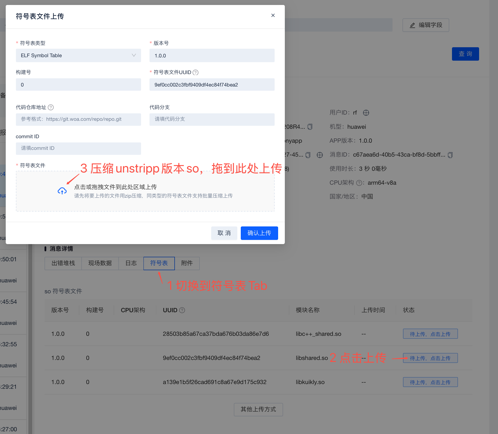

# 鸿蒙KN Crash监控和上报指引

## 1.编译选项设置


在build.gradke.kts中为鸿蒙设置`add-light-debug=enable`选项，使鸿蒙KN产物中保留调试信息，并使用sha1作为build-id。

```kotlin
ohosArm64 {
    binaries.sharedLib("shared") {
        freeCompilerArgs += "-Xadd-light-debug=enable"
        linkerOpts += "--build-id=sha1"
    }
}
```

Kuikly默认会在调用Kotlin逻辑时为用户catch异常，但这只是历史默认行为，目前强烈建议通过把catchException设置为false禁用此逻辑。catchException标志位仅在1.30.0+版本中有效，请注意升级版本。

```kotlin
ksp {
    arg("catchException", "false")
}

```

## 2.注册Kotlin UnhandledExceptionHook

为简化起见，这里以通过knoi方式回调上报为例。

首先在Kotlin侧实现注册函数，供ArkTS侧调用。
``` kotlin
@ServiceProvider(singleton = true)
open class XXBuglyService {
    @OptIn(ExperimentalNativeApi::class)
    fun registerUnhandledExceptionHook(reportOperation: (Array<JSValue>) -> Unit) {
        var old: ReportUnhandledExceptionHook? = null
        old = setUnhandledExceptionHook {
            val errorName = it::class.qualifiedName ?: "unknown"
            val message = it.message ?: "unknown"
            val callstack = it.getStackTraceForBuglyReport()

            reportOperation(
                arrayOf(
                    JSValue.createJSValue(errorName, mainTid),
                    JSValue.createJSValue(message, mainTid),
                    JSValue.createJSValue(callstack, mainTid),
                    JSValue.createJSValue(true, mainTid)
                )
            )
            old?.invoke(it)
            terminateWithUnhandledException(it)
        }
    }
}
```

## 3.ArkTS侧对接Bugly

按照[Bugly接入文档](https://docs.bugly.woa.com/harmony/quick_start/guide)接入Bugly后，在App启动生命周期，例如在AbilityStage onCreate的时候执行初始化，并通过knoi向kotlin注册上报回调。
``` ts
initCrashReport(c: Context): void {
    if (CrashReport.initialize) {
      return;
    }
    this.context = c
    let builder = new BuglyBuilder();
    builder.appId = 'xxxxxxx';   // 必填，Bugly产品信息中的APP ID
    builder.appKey = 'xxx-xxxx-xxxx-xxxx-xxxx';    // 必填，Bugly产品信息中的APP KEY    // builder.appId = 'xxxxxxx';   // 必填，Bugly产品信息中的APP ID
    builder.deviceId = "12345";     // 必填，设备ID，应保证设备ID对不同设备唯一
    builder.platform = BuglyBuilder.PLATFORM_PRO;    // 必填，设置上报平台，OA版本需设置为[BuglyBuilder.PLATFORM_OA]
    
    builder.appVersion = '1.0.0';   // 选填，业务的App版本
    builder.appVersionMode = BuildProfile.DEBUG ?  AppVersionMode.DEBUG : AppVersionMode.RELEASE;//"DEBUG";  // 选填，当前App的版本类型，支持根据不同的版本类型下发配置
    builder.buildNum = '0';         // 选填，业务App版本的构建号
    builder.appChannel = 'website'; // 选填，业务App渠道
    builder.userId = "12345";       // 选填，用户ID，如不设置则为空
    builder.deviceModel = "huawei"; // 选填，机型，如不设置则为空
    builder.debugMode = BuildProfile.DEBUG;       // 选填，默认开启，开启后Bugly SDK会打印更多调试日志，线上版本可关闭
    builder.sdkLogMode = true;      // 选填，设置debugMode或sdkLogMode均可开启Bugly sdk日志，适用于线上关闭debug模式但又希望打印bugly日志的场景
    builder.initDelay = 0;          // 选填，延迟初始化时间，单位ms
    builder.enableJsCrashProtect = false;   // 选填，是否开启Js异常崩溃保护，设置为true后发生未捕获Js异常，进程不会退出
    builder.enablePerfModules = ModuleName.AllModules;  // 选填，开启性能监控项，可传入单个性能模块名称或一组性能模块名称，此处初始化后，还需配置开启对应模块采样率，模块才会真正开启
    
    Bugly.init(c, builder);   // 如果需等待Bugly完全初始化完成，使用await Bugly.init(context, builder);
    
    // 通过knoi注册上报回调
    getKuiklyDemoBuglyService().registerUnhandledExceptionHook(this.postCrashRelatedError);
    // 注册crash相关的异常上报
    CrashReport.initialize = true
}

```

## 4.KN产物符号表备份和上传

以Release Build为例，KN产物构建出来后，默认位于`build/bin/ohosArm64/sharedReleaseShared/libshared.so`，它是一个unstripped版本的so，可以通过命令行进行确认，建议你对此产物进行备份。
``` shell
steven@Mac-mini demo % file build/bin/ohosArm64/sharedReleaseShared/libshared.so
libshared.so: ELF 64-bit LSB shared object, ARM aarch64, version 1 (SYSV), dynamically linked, BuildID[xxHash]=9b88243a06c77299, with debug_info, not stripped
```

在mac finder中选中`libshared.so`,单击右键并在pop up菜单选择压缩文件生成`libshared.so.zip`，把`libshared.so.zip`拖拽上传到Bugly。


符号表上传后，对应BuildID的Crash就可以被还原了。

还原前：
``` text
0 Multi-platform Stack:
1 UncaughtException:
2 exception: kotlin.IndexOutOfBoundsException
3 message: index: 1, size: 1
4 #00 pc 0000000000168f0b /data/storage/el1/bundle/libs/arm64/libshared.so (0) [arm64-v8a::914bbb25df0b98d1395de2ba65b9274b]
5 #01 pc 0000000000164437 /data/storage/el1/bundle/libs/arm64/libshared.so (0) [arm64-v8a::914bbb25df0b98d1395de2ba65b9274b]
6 #02 pc 0000000000164607 /data/storage/el1/bundle/libs/arm64/libshared.so (0) [arm64-v8a::914bbb25df0b98d1395de2ba65b9274b]
7 #03 pc 0000000000164727 /data/storage/el1/bundle/libs/arm64/libshared.so (0) [arm64-v8a::914bbb25df0b98d1395de2ba65b9274b]
8 #04 pc 00000000001f5b53 /data/storage/el1/bundle/libs/arm64/libshared.so (0) [arm64-v8a::914bbb25df0b98d1395de2ba65b9274b]
```
还原后：
``` text
0 Multi-platform Stack:
1 UncaughtException:
2 exception: kotlin.IndexOutOfBoundsException
3 message: index: 1, size: 1
4 #00 pc 0000000000168f0b kfun:kotlin.Throwable#<init>(kotlin.String?){} (Throwable.kt:28) [arm64-v8a]
5 #01 pc 0000000000164437 kfun:kotlin.Exception#<init>(kotlin.String?){} (Exceptions.kt:23) [arm64-v8a]
6 #02 pc 0000000000164607 kfun:kotlin.RuntimeException#<init>(kotlin.String?){} (Exceptions.kt:34) [arm64-v8a]
7 #03 pc 0000000000164727 kfun:kotlin.IndexOutOfBoundsException#<init>(kotlin.String?){} (Exceptions.kt:92) [arm64-v8a]
8 #04 pc 00000000001f5b53 kfun:kotlin.collections.AbstractList.Companion#checkElementIndex(kotlin.Int;kotlin.Int){} (AbstractList.kt:108) [arm64-v8a]
```