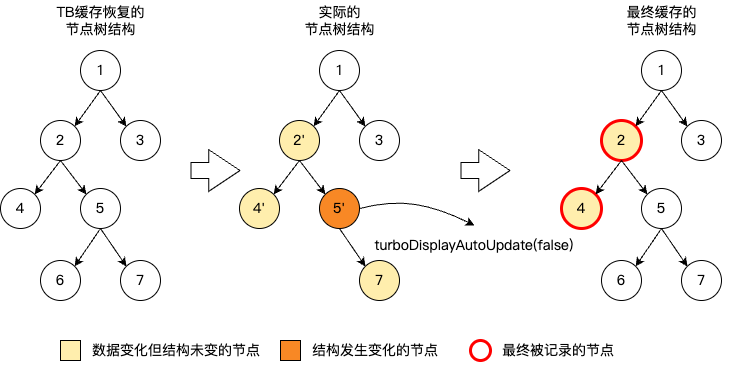

# TurboDisplay 首屏加速机制

<Badge text="版本 2.16.0 及以上支持" type="warn"/>  <Badge text="iOS 支持" type="warn"/>

## 介绍

TurboDisplay 是一套首屏加速机制，以`客户端`直出为实现路径，智能采集`Kuikly节点`作为缓存对象，业务只需打开开关即可享受首屏加速能力。

页面首次渲染时自动采集首屏内容并持久化到本地，后续再次打开时直接从缓存构建首屏 View，实现"秒开"效果。

TurboDisplay 默认加载页面的初始状态，且同时支持`恢复页面退出时状态`,如列表滚动位置、轮播图当前页等，详情可参考「页面状态恢复」章节。


## 使用指引

### 启用 TurboDisplay

TurboDisplay 运行于 Render 侧，仅需在 Native 侧配置启动开关，无需改动 Kotlin 业务代码。 在各页面容器中通过实现 `turboDisplayKey` 方法开启 TurboDisplay。**推荐使用 PageName 作为其值**，将作为缓存文件名称直接来源，实现页面间缓存隔离 ：


**iOS 配置：**
```objectivec
// KuiklyRenderViewController.m
- (NSString *)turboDisplayKey {
    return pageName;  // 返回 nil 或空字符串则关闭 TurboDisplay
}
```


### 管理 TurboDisplay 缓存（可选）
当业务需要在特定时机主动干预缓存内容时，如页面退出前保存当前状态、异常情况下清除缓存、特定交互后强制刷新缓存等，可通过 TurboDisplayModule 提供的方法进行操作：

- **`setCurrentUIAsFirstScreenForNextLaunch(extraContent)`** - 手动采集当前视图状态保存到缓存，调用后关闭自动采集
- **`flushTurboDisplayCache(iCloseUpdate)`** - 立即刷新缓存，`iCloseUpdate=true` 时关闭后续更新
- **`clearCurrentPageCache()`** - 清除当前页面缓存
- **`clearAllCache()`** - 清除所有页面缓存
- **`isTurboDisplay()`** - 判断本次打开是否使用了缓存上屏

使用示例

```kotlin
// 手动保存当前视图状态
acquireModule<TurboDisplayModule>(TurboDisplayModule.MODULE_NAME)
    .setCurrentUIAsFirstScreenForNextLaunch(extraContent)

// 判断本次是否使用了缓存上屏
val isFromCache = acquireModule<TurboDisplayModule>(TurboDisplayModule.MODULE_NAME)
    .isTurboDisplay()
```


### TurboDisplay 运行策略配置（可选）
默认情况下，TurboDisplay 自动完成缓存的采集与更新，无需业务干预。当页面存在以下场景时，可通过 TurboDisplayConfig 调整 TurboDisplay 的运行策略：

- 首屏内容存在结构变化（如列表项增减、条件渲染导致节点出现或消失）：开启结构变化采集模式，使缓存能感知节点增删
- 需要恢复页面退出时的状态（如列表滚动位置、轮播图当前页）：开启延迟更新模式，确保恢复逻辑执行完毕后再进行首屏增量更新
- 性能敏感、首屏内容稳定不变（如纯静态展示页）：可关闭实时跟踪和自动采集以减少开销

此外，还可通过 View 粒度的 turboDisplayAutoUpdateEnable 属性控制节点级别的缓存采集动作，精确控制指定节点及其子树是否参与缓存采集，详见下方「View 粒度采集控制」。

#### `全局采集控制：设置 TurboDisplayConfig 配置项`

diffDOMMode — 控制缓存采集时的算法
- Normal（默认）：只采集已有节点的属性变化
- StructureAware：同时采集节点的新增、删除和替换等结构变更

diffViewMode — 控制首屏增量更新的执行策略
- Normal（默认）：同步一次性完成差异对比和更新
- Delayed：延迟至渲染指令全部执行后再更新，支持页面恢复等交互场景

autoUpdateTurboDisplay — 控制是否在首屏至完全渲染期间自动采集界面变化
- true（默认）：自动捕捉界面属性变化并刷新缓存
- false：关闭自动采集，仅保留初始缓存

persistentRealTree — 控制是否持续跟踪业务首屏节点状态
- true（默认）：实时跟踪，确保缓存内容准确
- false：减少性能开销，但仅保留上一次存储的缓存

::: tip 配置项彼此关系
- `持续记录（persistentRealTree）` → `自动采集（autoUpdateTurboDisplay）` → `结构变化采集（diffDOMMode）` 呈链式依赖，前者是后者的前提。持续记录关闭后，纵使自动采集开启，缓存内容也不再变化；自动采集关闭，缓存内容同样不再变化。
- `首屏增量更新模式（diffViewMode）` 独立于以上三项，单独控制首屏增量更新的执行策略。
  :::


#### 配置示例

**iOS 配置：**
```objectivec
- (KRTurboDisplayConfig *)turboDisplayConfig {
    KRTurboDisplayConfig *config = [[KRTurboDisplayConfig alloc] init];
    
    [config enableStructureAwareDiffDOM];       // 启动结构捕捉
    [config enableDelayedDiff];                 // 启用分阶段执行的差异更新
    [config enableAutoUpdateTurboDisplay];      // 启动自动采集能力
    [config enablePersistentRealTree];          // 启动持续记录
    
    // 关闭以上能力的API
    [config disableStructureAwareDiffDOM];
    [config disableDelayedDiff];
    [config closeAutoUpdateTurboDisplay];
    [config disablePersistentRealTree];
    
    return config;
}
```


#### `View粒度采集控制`

通过 `turboDisplayAutoUpdateEnable` 属性，可控制指定节点及其子孙节点是否可被采集缓存，默认为 `true`。设置为 `false` 后，该节点及其子树的数据变化不会被采集到缓存中。




如图所示，在TubroDisplay机制加载页面过程中，`节点5'` 设置了 `turboDisplayAutoUpdateEnable(false)`，其子节点 `节点7'` 虽然发生属性变化，但不会被更新到缓存。而 `节点2` 未设置该属性，其属性变化正常记录。

::: tip
- 业务首屏和TurboDisplay缓存首屏进行差异更新时，为了可以将显示当前最新且正确的首屏效果，此时属于首屏阶段的组件所对应的 Native 节点，其结构变化与属性变化不受 `turboDisplayAutoUpdateEnable` 属性影响。
- turboDisplayAutoUpdateEnable 属性会控制「首屏-完全渲染」期间的属性变更，关闭后本次写入的缓存首屏与所读取的一致。
  :::

---


### 页面状态恢复（可选）

默认情况下，TurboDisplay 加载的是页面的初始状态。当需要恢复用户上次的浏览状态时（如列表浏览位置、轮播图当前页、Tab 选中状态等），可通过「页面状态恢复」机制实现，适用于长列表浏览位置、轮播图页面、Tab 选中状态等场景。

TurboDisplay 框架提供 `customFirstScreenTag` 字段用于传递自定义状态信息，业务可按需实现各类状态恢复。目前已验证支持 List、LazyList、PageList、Banner 等组件的位置恢复。

#### 实现步骤

以 **List 滚动位置恢复** 为例：

**第一步：滚动时保存位置到缓存**

```kotlin
List {
    event {
        scrollEnd {
            val (index, offset) = listViewRef.view.getFirstVisiblePosition()
            val extraContent = """{"${listViewRef.nativeRef}":{"viewName":"KRScrollView","contentOffsetX":${it.offsetX},"contentOffsetY":${it.offsetY},"firstVisibleIndex":$index,"firstVisibleOffset":$offset}}"""

            acquireModule<TurboDisplayModule>(TurboDisplayModule.MODULE_NAME)
                .setCurrentUIAsFirstScreenForNextLaunch(extraContent)
        }
    }
}
```

**第二步：页面启动时恢复位置**

```kotlin
override fun created() {
    val extra = getPager().pageData.customFirstScreenTag ?: return

    val listProps = JSONObject(JSONObject(extra).toMap().values.first().toString()).toMap()
    val offsetX = (listProps["contentOffsetX"] as? Number)?.toFloat() ?: 0f
    val offsetY = (listProps["contentOffsetY"] as? Number)?.toFloat() ?: 0f

    addTaskWhenPagerUpdateLayoutFinish {
        // lazyList 是调用ScrollToPosition(index,offset)方法实现恢复，详细的存储与恢复细节可参考 TBLazyListTestPage
        listViewRef.view.setContentOffset(offsetX = offsetX, offsetY = offsetY)
    }
}
```

::: tip 注意事项
- 复杂页面恢复时，尽量避免每次启动页面时都执行异步拉取数据，造成首屏跳变；
- 执行页面时，增量更新策略需调整为延迟模式，确保业务实际首屏的内容与缓存首屏内容保持一致，避免发生跳变现象。
  :::

> **完整示例参考：** `demo/src/commonMain/kotlin/com/tencent/kuikly/demo/pages/demo/TBDemoTest/` 此目录提供有 `List`, `LazyList`, `PageList`, `Scroller`, `WaterFallList`, `Banner` 组件在首屏实现恢复的实例

---

## 工作流程
1. 首次打开（生成缓存）

页面正常渲染，首屏完成后 TurboDisplay 自动将当前界面内容保存到本地缓存。若开启了自动采集，页面的`首屏 - 完全渲染`期间的首屏组件发生的属性变更会被持续记录，确保缓存内容始终接近业务实际效果。若打开支持结构变化的采集模式，则`完全渲染`时机前所有组件的变更皆会被记录；

2. 后续打开（缓存上屏 → 增量更新）

再次打开页面时，TurboDisplay 直接从缓存构建首屏 View 并显示，实现"秒开"。与此同时，业务逻辑在后台并行执行，构建真实的页面内容。待真实内容就绪后，TurboDisplay 自动对比缓存首屏与真实首屏的差异，仅更新变化的部分，最终展示真实的业务页面。若页面需要恢复上次的状态（如列表滚动位置），可开启延迟更新模式，确保恢复完成后再进行差异对比，避免页面跳变。

3. 智能采集（刷新缓存）

增量更新完成后，TurboDisplay 会继续跟踪页面内容的变化并刷新缓存。业务也可在特定交互时机（如用户滚动结束）主动保存当前视图状态。最终缓存中保存的始终是最新的页面效果，确保下次打开时展示的内容符合预期。
