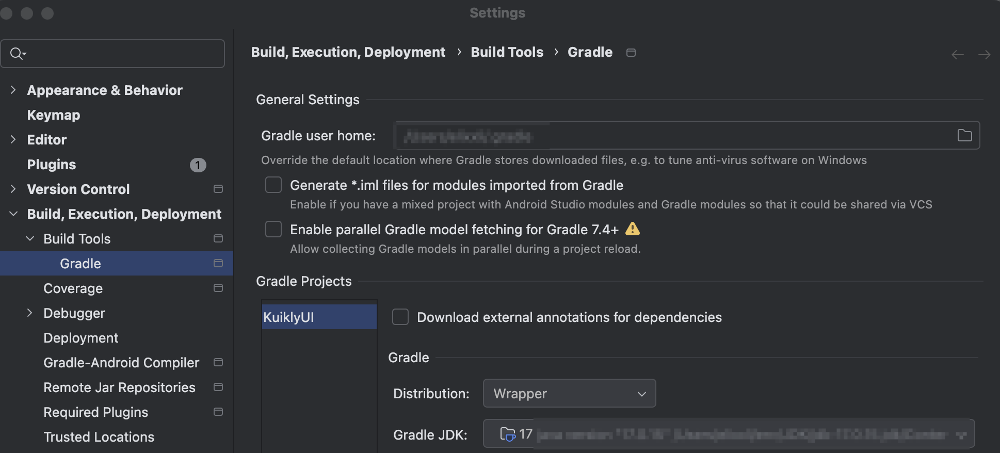

# 模块介绍与版本配置

## Kuikly模块简介

### core-ksp
KuiklyCoreEntry 是 KuiklyUI 框架的核心入口类，通过 KSP (Kotlin Symbol Processing) 自动生成。它的主要作用是： 
1. 作为 Kotlin 和 Native 代码之间的桥接层，提供双向方法调用能力；
2. 管理页面路由注册，自动注册所有标记了 @Page 注解的页面；
3. 提供统一的入口点来处理跨平台通信。

生成机制基于项目中的@Page注解，core-ksp会根据不同的编译任务生成各个平台需要的KuiklyCoreEntry。

>注: kotlin1.3、1.4 使用 core-kapt

### core-annotations
注解模块，定义业务注解@Page

### core
跨平台核心模块，实现各平台响应式UI、布局算法、Bridge通信等核心能力。

### compose
Compose UI跨平台模块，实现Compose UI组件、布局，桥接Kuikly核心能力。

### 各平台渲染器模块
安卓: core-render-android
iOS: core-render-ios
鸿蒙：core-render-ohos
web: core-render-web

### Kuikly版本号规则
- 对于KMP制品（包括 core-ksp、core-annotations、core、compose）和 安卓渲染层（core-render-android) 的版本号规则为：`Kuikly版本号-kotlin版本号` 如：`2.12.0-2.1.21`

- 对于 iOS(OpenKuiklyIOSRender)、鸿蒙(kuikly-open/render)渲染层制品的版本号规则为：`Kuikly版本号` 如 `2.12.0`

:::tip 注意
版本号需要**保持一致**，否则有可能出现编译错误或者功能预期不匹配等问题。

如KMP制品(core-ksp、core-annotations、core)使用的版本号是`2.12.0-2.1.21`

渲染层的版本号需要对应使用 `2.12.0`，即：

- 安卓(core-render-android)：`2.12.0-2.1.21`
- iOS(OpenKuiklyIosRender)：`2.12.0`
- 鸿蒙(kuikly-open/render)：`2.12.0`

:::

## 版本兼容

Android Studio是目前Android开发最常用的集成开发环境（IDE），它使用Gradle进行项目构建，并且可以集成专门针对Android应用构建的Android Gradle Plugin(AGP)。另外如果项目中需要使用Kotlin，还需要集成Kotlin Gradle Plugin(KGP)。在开发过程中，如果AGP、KGP、Gradle不兼容，可能会导致编译失败，下面简单介绍一下AGP、KGP与Gradle的兼容性。

### 推荐配置
:::tip 注意
以下为推荐配置，不作强制要求。业务工程可根据自身实际情况灵活选择版本组合，但需确保所选版本之间相互兼容。

若业务工程已有固定的 Kotlin、AGP 或 Gradle 版本约束，通常可以直接接入相对应kotlin版本的Kuikly制品，一般不会引入额外的兼容性问题。
:::

| kotlin         | AGP   | ksp           | Gradle |
|:---------------|-------|:--------------|--------|
| 2.1.21         | 8.5.0 | 2.1.21-2.0.1  | 8.7    |
| 2.0.21         | 8.5.0 | 2.0.21-1.0.27 | 8.7    |
| 2.0.21-KBA-010 | 8.5.0 | 2.0.21-1.0.27 | 8.7    |
| 1.9.22         | 7.4.2 | 1.9.22-1.0.17 | 7.5.1  |
| 1.8.21         | 7.4.2 | 1.8.21-1.0.11 | 7.5.1  |
| 1.7.20         | 7.4.2 | 1.7.20-1.0.7  | 7.5.1  |

### AGP、Gradle、JDK兼容性

| AGP | 最低Gradle | 最低JDK |
|-----|:---------|:------|
| 8.8 | 8.10.2   | 17    |
| 8.7 | 8.9      | 17    |
| 8.6 | 8.7      | 17    |
| 8.5 | 8.7      | 17    |
| 8.4 | 8.6      | 17    |
| 8.3 | 8.4      | 17    |
| 8.2 | 8.2      | 17    |
| 8.1 | 8.0      | 17    |
| 8.0 | 8.0      | 17    |
| 7.4.x | 7.5      | 11    |
| 7.3.x | 7.4      | 11    |
| 7.2.x | 7.3.3    | 11    |
| 7.0.x | 7.0.2    | 11    |

更多内容可以参考：[关于 Android Gradle 插件](https://developer.android.com/build/releases/about-agp?hl=zh-cn)

JDK版本除了设备环境的需要适配，对于Android Studio本身自带的JDK版本可能为21，此处也需要调整为适配的版本

`Android Studio -> Settings -> Build,Execution,Deployment -> Build Tools -> Gradle`

> [AGP9](https://developer.android.google.cn/build/releases/agp-9-0-0-release-notes?hl=zh-cn)，由于变更较大，适配指南后续支持。

### Android Studio 和 AGP 兼容性
| Android Studio 版本 | AGP版本范围  |
|-------------------|:---------|
| 2025.3.1          | 4.0-9.0  |
| 2025.2.3          | 4.0-9.0  |
| 2025.2.2          | 4.0-8.13 |
| 2025.2.1          | 4.0-8.13 |
| 2025.1.4          | 4.0-8.13 |
| 2025.1.3          | 4.0-8.13 |
| 2025.1.2          | 4.0-8.12 |
| 2025.1.1          | 3.2-8.11 |
| 2024.3.2          | 3.2-8.10 |
| 2024.3.1          | 3.2-8.9  |

### Kuikly工程制品版本编译

为了提供更好兼容性，Kuikly工程制品使用的为最低版本，并非推荐配置，此处列出Kuikly制品编译过程所使用的AGP、KSP、Gradle版本。

| kotlin         | AGP   | ksp           | Gradle |
|:---------------|:------|:--------------|--------|
| 2.1.21         | 7.4.2 | 2.1.21-2.0.1  | 7.6.3  |
| 2.0.21         | 7.4.2 | 2.0.21-1.0.27 | 7.6.3  |
| 2.0.21-KBA-010 | 7.4.2 | 2.0.21-1.0.27 | 8.0    |
| 1.9.22         | 7.4.2 | 1.9.22-1.0.17 | 7.5.1  |
| 1.8.21         | 7.4.2 | 1.8.21-1.0.11 | 7.5.1  |
| 1.7.20         | 7.1.3 | 1.7.20-1.0.7  | 7.3.3  |
| 1.6.21         | 7.1.3 | 1.6.21-1.0.6  | 7.3.3  |
| 1.5.31         | 7.1.3 | 1.5.31-1.0.0  | 7.3.3  |
| 1.4.20         | 4.2.1 | /             | 7.3.3  |
| 1.3.10         | 3.5.4 | /             | 5.4.1  |

